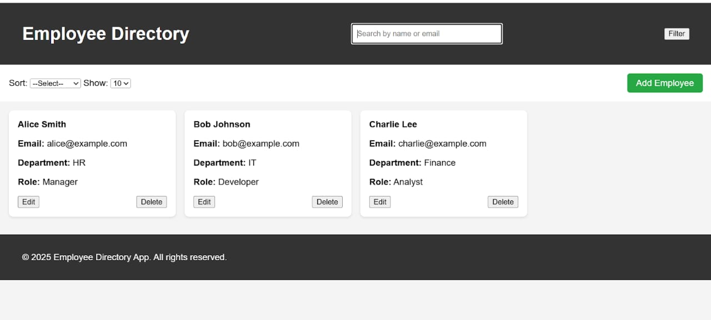
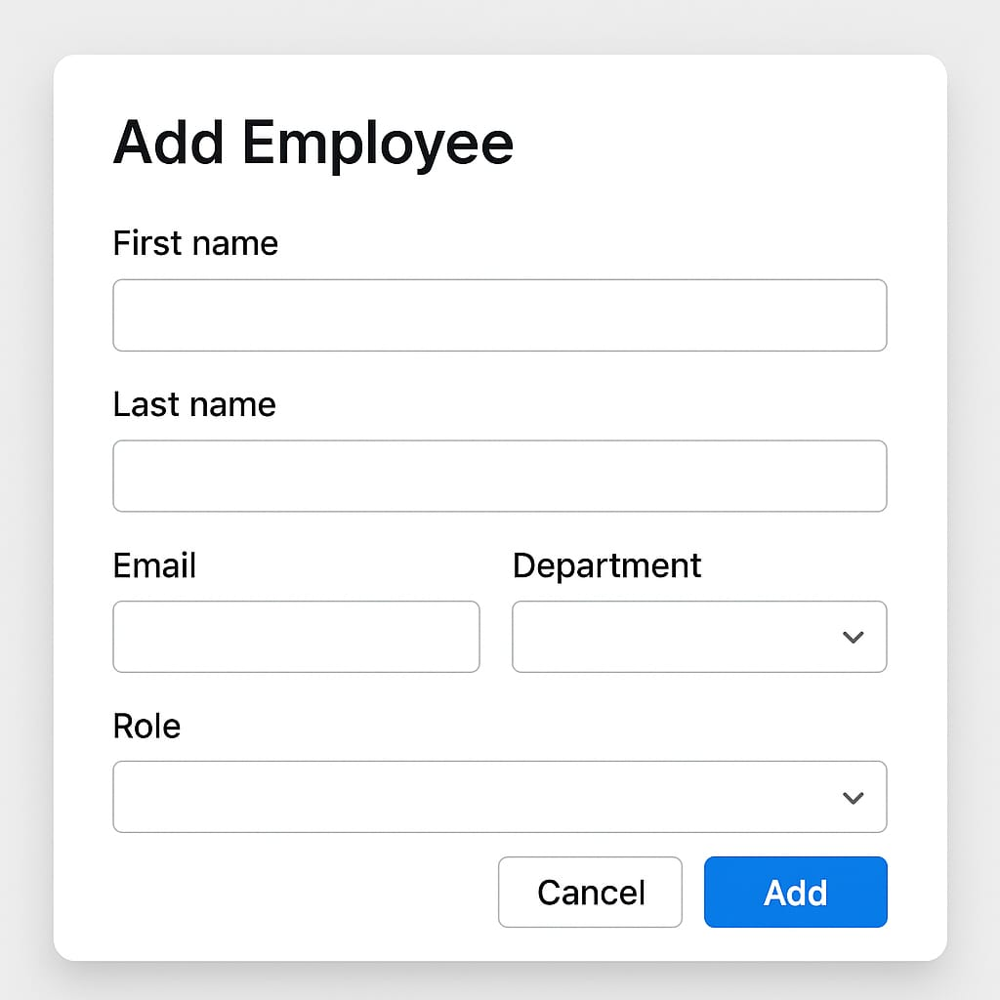
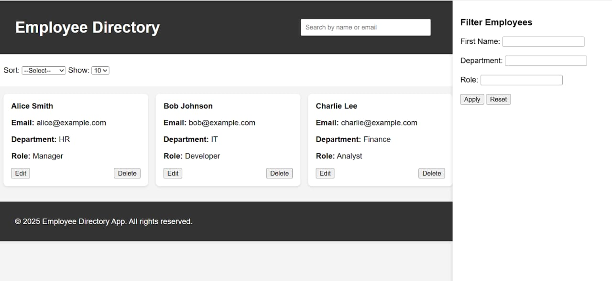

# Employee Directory

Responsive, filterable employee directory built with HTML, CSS, JavaScript, and Freemarker.

## Features
- Add/Edit/Delete employee
- Filter by First Name, Department, Role
- Search by name/email
- Sort by First Name & Department
- Pagination (change items per page)
- Responsive design

## Setup
Open `index.html` directly in browser.

## Project Structure
- `index.html` – Main page
- `css/styles.css` – Styling
- `js/script.js` – Logic
- `data/employees.ftl` – Mock employee data

## Screenshot
### Dashboard Page

### Add/Edit Form

### Filter & Sort

## Reflection
Built fully frontend, no backend. Could improve UX with animations, better validation, and real backend.
